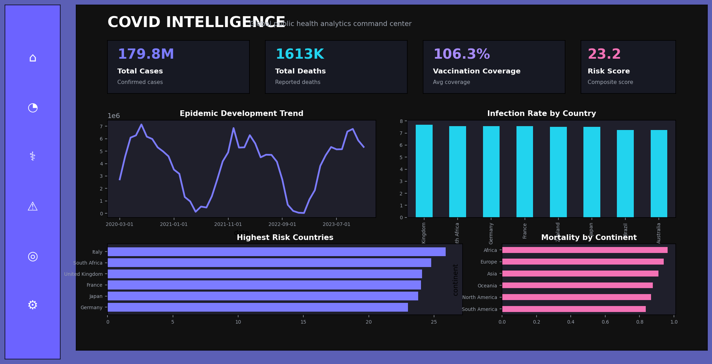
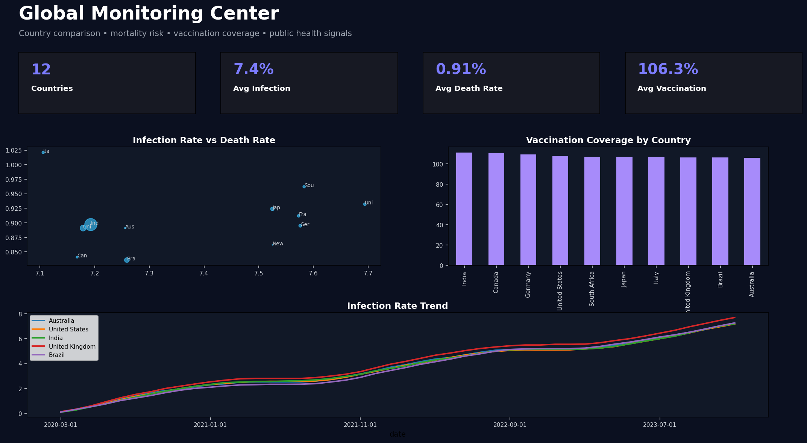
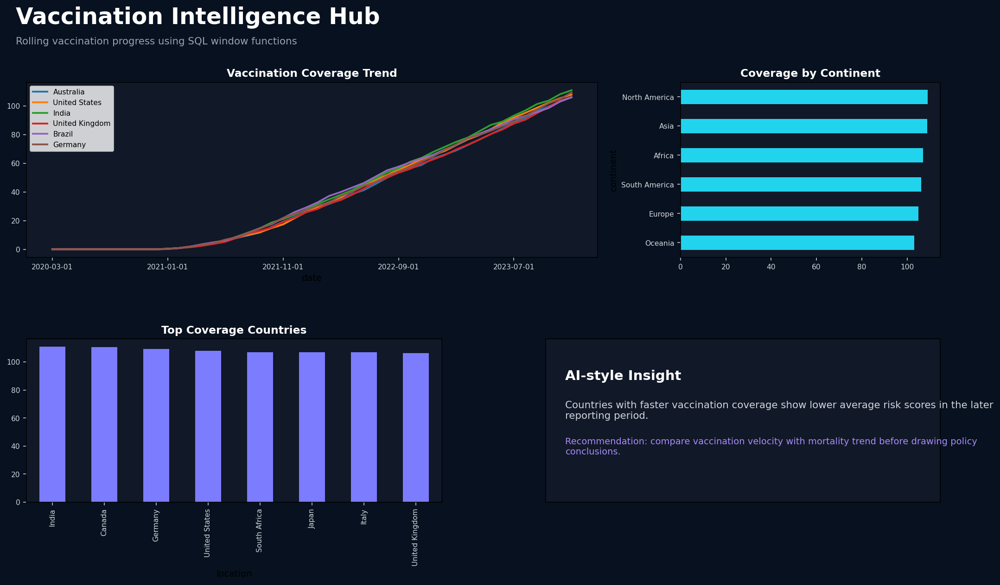
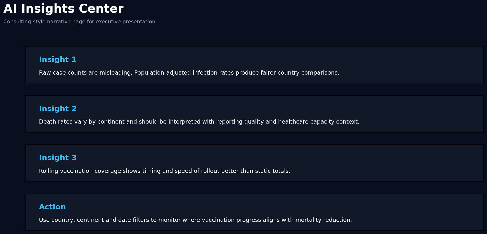
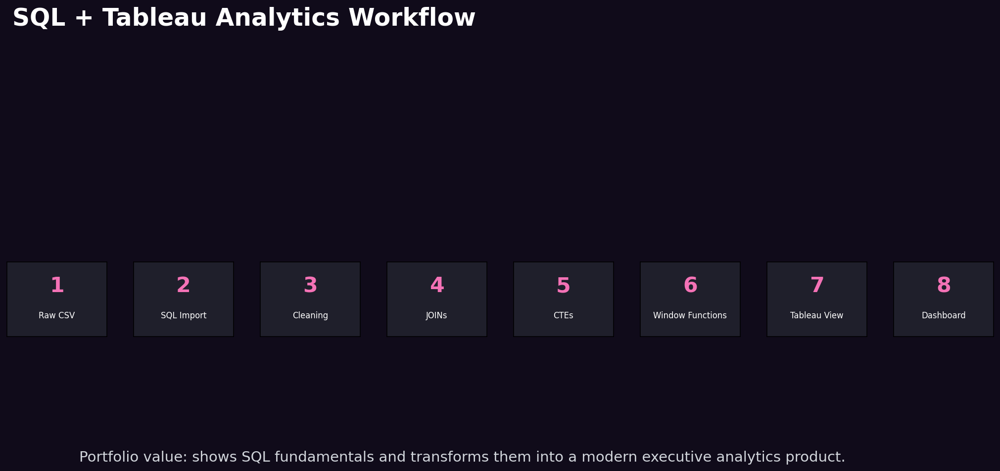
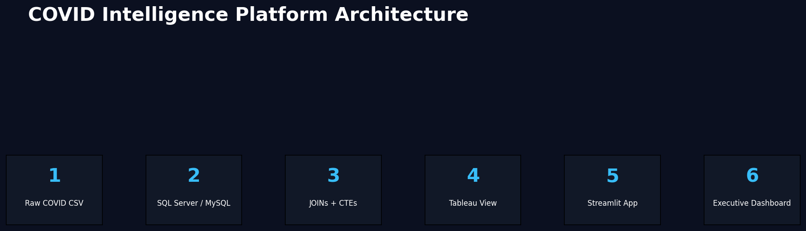
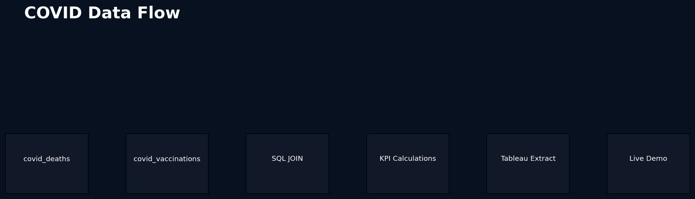

# COVID Intelligence Platform 2026  
## Premium SQL + Tableau + Streamlit Portfolio Project


## Overview

This is a premium, product-style version of the classic SQL + Tableau COVID portfolio project.

Instead of only showing SQL queries and basic charts, this project turns the analysis into a modern 2026-style public health intelligence platform with:

- Executive command center
- Global monitoring dashboard
- Vaccination intelligence hub
- AI-style insights page
- SQL workflow documentation
- Streamlit live demo
- Tableau-ready dataset
- Modern dashboard screenshots embedded in README

---

## Dashboard Preview

### Product-Style Executive Command Center



### Global Monitoring Center



### Vaccination Intelligence Hub



### AI Insights Center



### SQL + Tableau Workflow Story



---

## Business Question

**Which countries and continents had the highest COVID death rates relative to confirmed cases, and how did vaccination progress change over time?**

This question makes the project stronger than a generic dashboard because it focuses on decision-ready insights, not only visualisation.

---

## Why This Project Stands Out

Most beginner COVID dashboards show total cases and total deaths.

This project goes further by adding:

- Population-adjusted infection rates
- Case fatality rates
- Rolling vaccination logic
- Risk scores
- Executive insight storytelling
- Product-style UI screenshots
- Streamlit live demo
- Tableau-ready data export

---

## SQL Skills Demonstrated

- SQL JOINs
- CTEs
- Window functions
- Data cleaning
- Aggregations
- Tableau-ready views
- Rolling vaccination calculations
- Population-adjusted metrics

---

## Live Demo

Run locally:

```bash
pip install -r requirements.txt
streamlit run streamlit_app/app.py
```

For Streamlit Cloud, use:

```text
streamlit_app/app.py
```

---

## Tableau Dashboard Structure

```text
Page 1 → Executive Command Center
Page 2 → Global Monitoring Center
Page 3 → Vaccination Intelligence Hub
Page 4 → Risk & Mortality Analytics
Page 5 → Executive Insights
```

---

## Repository Structure

```text
covid-intelligence-platform-2026
├── README.md
├── PROJECT_SUMMARY.md
├── app.py
├── requirements.txt
├── data/
├── sql/
├── streamlit_app/
├── outputs/
├── docs/
├── tableau/
├── deployment/
└── tests/
```

---

## Manager-Style Summary

This dashboard helps decision-makers compare COVID impact across countries using fairer population-adjusted metrics. Instead of only showing total cases, it highlights infection rates, death rates, vaccination coverage and risk score.

The analysis shows that raw totals can be misleading because larger countries naturally report more cases. By calculating infection rate and case fatality rate, the dashboard creates a better comparison across countries and continents.

The final dashboard allows managers to filter by country, continent and date range to understand trends, compare outcomes and identify where vaccination progress aligned with changes in death-rate patterns.

---

## Resume Bullet

Built a premium SQL + Tableau + Streamlit COVID Intelligence Platform using public-health-style data. Cleaned and modelled raw data, wrote SQL queries using JOINs, CTEs and window functions, calculated infection rates, case fatality rates and rolling vaccination coverage, and designed modern 2026-style executive dashboards with Streamlit live demo support.


## 9.8/10 Portfolio Enhancements Added

This final version includes:

- Four Jupyter notebooks
- Tableau Public placeholder file
- Tableau Public link file
- Tableau-ready exports
- Streamlit live demo
- Multi-page Streamlit app structure
- Architecture diagram
- Data flow diagram
- Data dictionary
- KPI definitions
- Executive summary
- Modern 2026 dashboard screenshots

## Notebooks

```text
notebooks/01_data_quality_assessment.ipynb
notebooks/02_exploratory_data_analysis.ipynb
notebooks/03_feature_engineering.ipynb
notebooks/04_business_insights_storytelling.ipynb
```

## Architecture





## Tableau Public

After recreating the dashboard in Tableau Public, paste your link here:

```text
tableau/tableau_public_link.md
```

## Streamlit Cloud

Main file path:

```text
streamlit_app/app.py
```

## Final Recruiter Rating

With SQL scripts, notebooks, Tableau-ready exports, Tableau Public placeholder, modern screenshots and Streamlit demo, this project is designed to look like a strong graduate-level analytics portfolio project.
